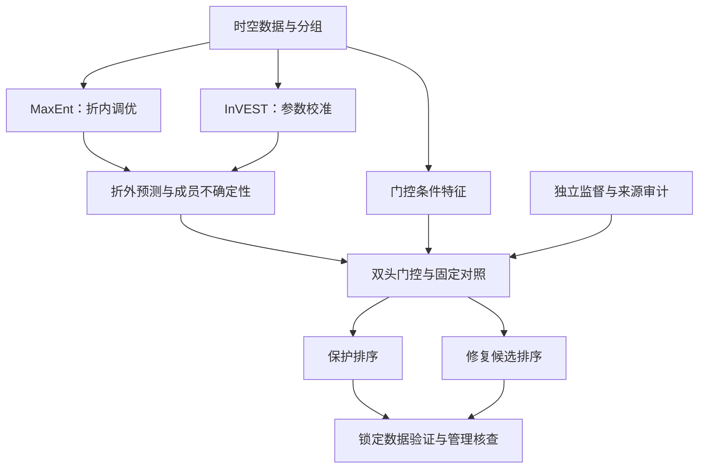

# 黄河湿地 MaxEnt–InVEST 耦合底座 v0.1

这是一套可以实际运行的研究代码：接入 MaxEnt/HQ 输出，计算保护与修复候选双指标，保留固定对照，按独立监督训练双头门控，审核预测来源，并读写 GeoTIFF。**郑州市试点已完成原始观测核查、环境接入和历史保护对照，尚未重新训练真实 MaxEnt/InVEST/门控或证明动态融合优于基线。**

优先阅读 [文献与建模决策](docs/文献与建模决策.md)、[数据接入说明](docs/数据接入说明.md) 和 [验收记录](docs/验收记录.md)。

郑州市真实数据进度、七步训练条件及本机 Windows 运行入口见 [郑州市试点实施路线](docs/郑州市试点_实施路线.md)。本地观鸟与派生数据由 `.gitignore` 排除；`runs/demo_001` 仍为原包的合成演示。



## 运行

在新的 Python 3.10–3.12 环境中安装。你原来的 PyTorch 2.5.1 环境也可使用，但建议为本项目单独建环境，避免 GIS 软件自带环境发生依赖冲突。

```bash
python -m pip install -e .
python scripts/run_demo.py --out runs/demo_002
python -m unittest discover -s tests -v
```

CPU 即可完成演示。真实推理可以后续增加 GPU/栅格门控输出；v0.1 的 GeoTIFF 命令提供固定融合，训练后的动态门控提供 CSV 推理和配对成员传播 API。

## 真实数据先跑固定对照

填写 `templates/samples.csv`，得到 `your_samples.csv`。分数为 0–1 的研究指数，不是已经校准的物种出现概率。

```bash
python -m wetland_coupling baseline --csv your_samples.csv --out runs/real_baseline_001
python -m wetland_coupling baseline --csv your_samples.csv --out runs/real_linear_001 --method linear
python -m wetland_coupling baseline --csv your_samples.csv --out runs/real_relative_loss_001 --deficit-mode relative_degradation
```

`--deficit-mode relative_degradation` 使用 `1−HQ/H_j`，用于区分土地类型本身适宜性低和同类型内受威胁后质量下降。原始 `1−HQ` 版本仍保留为低 HQ 候选对照。两种版本都需要修复可行性证据，均不能直接解释为真实修复收益。

## GeoTIFF 接入

```bash
python -m wetland_coupling raster --m spring_maxent.tif --h quality_c_ref.tif --feasible restoration_feasible.tif --habitat-suitability habitat_suitability_by_lulc.tif --out runs/spring_raster_001
```

要求四幅单波段图的投影、分辨率、范围、行列和像元原点完全一致。掩膜取有效域交集，NoData 显式保留。默认每次新建目录，已有输出不会被覆盖。继承你们现有 100 m 参考栅格接口；真实 CRS 从输入读取，不硬编码演示用的坐标系。

输出 `conservation_score.tif`、`restoration_candidate_score.tif`、`management_reference_zones.tif` 和带哈希的 `manifest.json`。参考分区的阈值 0.7 是演示/配置值，需要在真实研究中独立论证，不能作为已经确定的保护区边界。

## 动态门控训练

```bash
python -m wetland_coupling train --csv your_samples.csv --provenance your_provenance.json --config configs/gate.json --out runs/real_gate_001
python -m wetland_coupling predict --csv new_samples.csv --checkpoint runs/real_gate_001/gate.pt --out runs/real_predict_001
```

必须提供独立的 `target_protection` 和/或 `target_restoration`，以及底层模型 fit/tune/calibrate 的样本与空间组记录。只有鸟类出现点时，不能自动构造两个管理目标的真实标签。缺少整个修复任务的监督数据时，该头固定为 0.5/0.5 并记录为未训练；两个任务都缺监督时，训练会停止，仍可运行固定基线。

`runs/demo_001/` 内所有输入、权重、预测和指标均为合成工程演示。演示 checkpoint 需要显式 `--demo` 才能调用，不能当作黄河湿地模型使用。

## InVEST 参数与校准接口

1. 填写 `templates/parameter_evidence.csv`，为权重、距离、敏感度、H_j 和半饱和常数整理本地证据。
2. 复制 `configs/invest_prior.pending.json`，补齐范围和证据。没有本地依据的范围保持空值；代码会拦截。
3. 每个底层训练折内部生成和比较参数候选，不能用耦合验证集或最终测试集调参。

```bash
python -m wetland_coupling invest-plan --prior reviewed_prior.json --threats your_threats.csv --sensitivity your_sensitivity.csv --lulc your_lulc.tif --members 32 --out runs/invest_plan_001
python -m wetland_coupling invest-run --args runs/invest_plan_001/invest_0000/args.json
python -m wetland_coupling calibration-rank --csv inner_calibration_scores.csv --out calibration_ranking.csv
```

官方 InVEST 执行适配器依据 **3.16.1** 源代码核查并锁定版本；需另行安装官方 `natcap.invest` 和相应 GDAL 环境。本次没有安装或运行官方 InVEST。3.15 起 `max_dist` 改用 **米**，并有算法/字段变化；不要仅转换单位后宣称与历史运行完全等价。

`invest-plan` 是先验探索的运行计划，不是自动校准结果；`calibration-rank` 只汇总你们在底层内层空间折上真实计算的候选指标。两者均不生成贝叶斯后验。

## 代码入口

| 文件 | 职责 |
|---|---|
| `fusion.py` | 几何/线性/最小值基线、两类修复缺口定义、参考分区、配对成员传播 |
| `model.py` | 小型残差 MLP、两个受约束 Softmax 门控头 |
| `training.py` | 独立目标的掩膜损失、早停、常数权重对照、加载/推理、动态成员传播 |
| `audit.py` | 数据字段、值域、重复单元、底层拟合来源、伪标签和验证泄漏检查 |
| `splits.py` | 米制空间块编号、底层交叉拟合与内层调参计划 |
| `parameters.py` | 有证据的参数空间采样、官方模型运行计划与候选校准汇总 |
| `rasters.py` | 分块 GeoTIFF 融合、空间对齐检查、NoData 和输出记录 |

输入成员的不确定性传播为 q05/median/q95 和参考分区一致率，描述给定成员的结果范围，不宣称 90% 覆盖置信区间。动态门控的权重是条件性的统计分配，不应解释成生态因果贡献。
